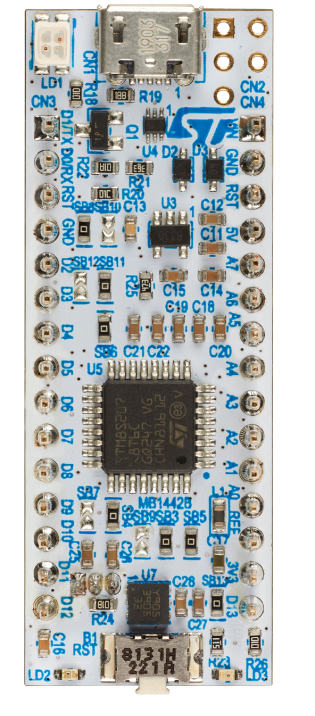
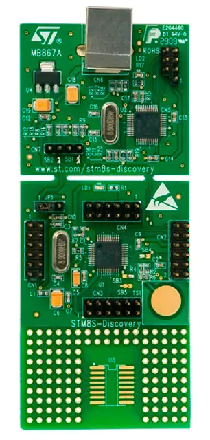

[français](readme.md)

# STM8EF
The goal of this project is to adapt the original C.H. Ting [stm8ef.asm.org](stm8ef.asm.org) file to be assembled with sdasstm8 (part of sdcc project). By the same the project as been extented to add features and to support other boards. 

## Supported boards 

* **NUCLEO-8S207K8**<br>
* **NUCLEO_8S208RB**<br>
* **STM8S-DISCOVERY**<br>


## building from project sources 

* project source is on [https://github.com/Picatout/stm8_eforth](https://github.com/Picatout/stm8_eforth)

This open source project is distributed under [GPL V3](LICENSE.TXT) license.

### required software tools  

* make 
```
sudo apt install make 
```
* [sdcc](https://sdcc.sourceforge.net/), open source Small Device C Compiler. **sdasstm8** is part of it.  
```
sudo apt install sdcc 
```
* [stm8flash](https://github.com/vdudouyt/stm8flash). This one must be build and installed from project sources. 

### How to to build stm8 eforth for a specific target
* In [inc/config.inc](inc/config.inc) file select the target board or MCU by setting its variable to **1** and all other to **0**. 
```
NUCLEO_8S207K8=1 
NUCLEO_8S208RB=0
DISCOVERY=0
DOORBELL=0
```
* For **WANT_** options set to **1** the ones to include in the binary and others to **0**. 

* There is a makefile __"*.mk"__ for every target. It define 3 variables and launch main *Makefile*.  
```
####################################
# Make file for NUCLEO_8S207K8 board
####################################
BOARD=stm8s207k8
PROGRAMMER=stlinkv21
FLASH_SIZE=65536
include Makefile
``` 

* The files resulting from build process are stored in subdirectory of  **build** holding the name of target **BOARD** variable. 
```
~/github/stm8_eforth$ ls build
stm8s105c6  stm8s105k6  stm8s207k8  stm8s208rb
```

* To build and flash the target with binary type the following command.
```
make -fnucleo_8s207.mk 
```
Here **nucleo_8s207.mk**  is the makefile of selected target.

* If you want to compile without flashing 
```
make -fnucleo_8s207.mk compile 
```

## documentation 

At this time documentation is only available in french in PDF format in **docs** folder.

* [référence du langage eforth](docs/référence_eforth.pdf)
* [tutoriel eforth](docs/tutoriel.pdf)
