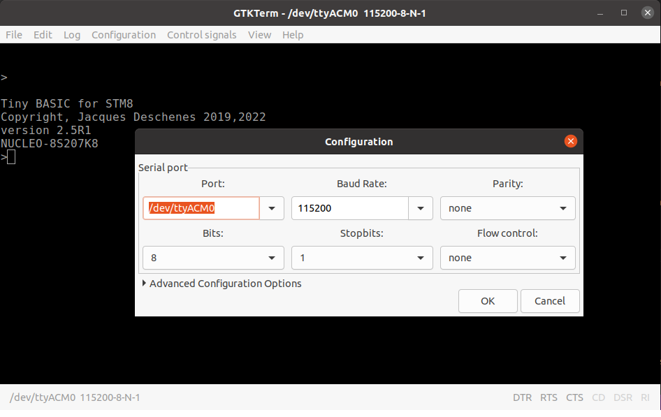
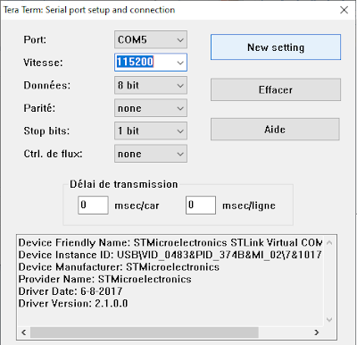

[français](readme.md)

# STM8EF
The goal of this project is to adapt the original C.H. Ting [stm8ef.asm.org](stm8ef.asm.org) file to be assembled with sdasstm8 (part of sdcc project). By the same the project as been extented to add features and to support other boards. 


<a id="index"></a>

[Supported boards](#cartes)

[Building from sources](#build)

[Terminal configuration](#terminal)

[Documentation](#docs)

[About eForth](#eForth)

[About C.H. Ting](#Ting)

[Release notes](#release)

<hr>
<a id="cartes"></a>

## Supported boards 

* **NUCLEO-8S207K8**<br>
* **NUCLEO_8S208RB**<br>
* **STM8S-DISCOVERY**<br>

[index](#index)

<hr>

<a id="build"></a>

## building from project sources 

* project source is on [https://github.com/Picatout/stm8_eforth](https://github.com/Picatout/stm8_eforth)

This open source project is distributed under [GPL V3](LICENSE.TXT) license.

### required software tools  

* make 
```
sudo apt install make 
```
* [sdcc](https://sdcc.sourceforge.net/), open source Small Device C Compiler. **sdasstm8** is part of it.  
```
sudo apt install sdcc 
```
* [stm8flash](https://github.com/vdudouyt/stm8flash). This one must be build and installed from project sources. 

### How to to build stm8 eforth for a specific target
* In [inc/config.inc](inc/config.inc) file select the target board or MCU by setting its variable to **1** and all other to **0**. 
```
NUCLEO_8S207K8=1 
NUCLEO_8S208RB=0
DISCOVERY=0
DOORBELL=0
```
* For **WANT_** options set to **1** the ones to include in the binary and others to **0**. 

* There is a makefile __"*.mk"__ for every target. It define 3 variables and launch main *Makefile*.  
```
####################################
# Make file for NUCLEO_8S207K8 board
####################################
BOARD=stm8s207k8
PROGRAMMER=stlinkv21
FLASH_SIZE=65536
include Makefile
``` 

* The files resulting from build process are stored in subdirectory of  **build** holding the name of target **BOARD** variable. 
```
~/github/stm8_eforth$ ls build
stm8s105c6  stm8s105k6  stm8s207k8  stm8s208rb
```

* To build and flash the target with binary type the following command.
```
make -fnucleo_8s207.mk 
```
Here **nucleo_8s207.mk**  is the makefile of selected target.

* If you want to compile without flashing 
```
make -fnucleo_8s207.mk compile 
```
[index](#index)
<hr>

<a id="terminal"></a>

## Terminal configuration 
STM8 eForth user interface is through a serial port. When a __NUCLEO__ board is connected to PC a virtural port is created on the PC which is used for this purpose. 

The serial port parameters are the following:

* __115200 BAUD__
* __8 BITS__
* __1 STOP__
* __NO PARITY BIT__

Here a configuration example using GTKTerm on Ubuntu/Linux<br>


Another example with Tera Term on Windows<br>


STM8 eForth use __CR__ character as line terminator by default but there is an option in [config.inc](inc/config.inc) file to change it for __LF__.


[index](#index)
<hr>

<a id="docs"></a>

## documentation 

At this time documentation is only available in french in PDF format in **docs** folder.

* [référence du langage eforth](docs/référence_eforth.pdf)
* [tutoriel eforth](docs/tutoriel.pdf)

[index](#index)

<hr>

<a id="eForth"></a>

## About eForth 
Originally eForth has been designed by Bill Muench to be easily portable from one processor to another. This objective was acheived by writting a minimum of words in assembly (about 35) and the rest was written in eForth itself. This was in the 80's, the glorious years of Forth when each 8 bits PC had Forth software available for it. Apple II, TRS-80, SX-SPECTRUM, etc. Forth was also available for CP/M systems. 

Years after when microcontrollers became commonly available to hobbyists, C.H. Ting started to port eForth on many microncontrollers platforms, 8,16,32 bits varieties. Even GreenArrays GA144 
chip which is 144 Forth computer on a single chip has eForth in ROM on 1 of is computer.<br>

[index](#index)

<hr>

<a id="Ting"></a>

## About C.H. Ting 
Mr Ting is known if Forth universe for porting eForth on many platforms but he also published [books](https://www.amazon.ca/-/fr/C-H-Ting/dp/1726852369/ref=sr_1_1?__mk_fr_CA=%C3%85M%C3%85%C5%BD%C3%95%C3%91&crid=2GR3TY7F38NZ6&keywords=c.+h.+Ting&qid=1670532072&sprefix=c+h+ting%2Caps%2C72&sr=8-1) on the subject. 

In 2011 he ported eForth on STM8-Discovery. This project is based on Mr Ting [original source file](stm8ef.asm.org). I ignore which dev tools was used by Mr Ting but I decided to port it to [SDCC](https://sdcc.sourceforge.net/) assembler-compiler.

Aside from recoding large parts of the project, I expanded by adding many modules:

* [const_ratio.asm](const_ratio.asm)  This module define a set 2 constants that by their ratio approximates real numbers like PI and others. Their use is with the word __*/MOD__. The first constant is multiplied by an integer which product is kept as double integer then divided by the second constant. 

* [ctable.asm](ctable.asm) Define a set of words to facilitate the creation of constants table to be stored in flash memory. 

* [double.asm](double.asm) Define words for arithmetics operations on double integers i.e. 32 bits integers. 

* [float.asm](float.asm) Define words for arithmetics operations on 32 bits floatting point numbers. 

* [float24.asm](float24.asm) Define words for arithmetics operations on 24 bits floatting point numbers. 


[index](#index)

<hr>

<a id="release"></a>

## Release notes 


[index](#index)
