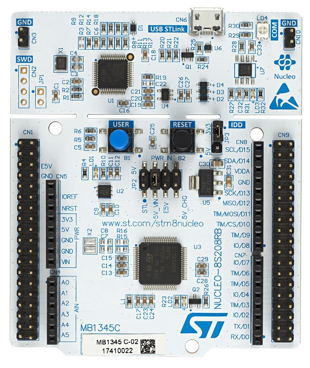

# Manuel de référence pour le stm8_eForth sur carte NUCLEO-8S208RB 

Ce manuel est écris pour la version 3.0. Il s'agit d'une présentation du vocabulaire du système.

### Conventions 

Le nom du mot est suivit d'un commentaire entre parenthèse qui indique l'état de la pile des arguments avant et après l'exécution du mot. Le double tiret sépare la situation avant de la situation après. Si le mot affecte le contenu de la pile des retours celle-ci est indentifiée par **R:** suivit de la liste des éléments. Dans les schémas de piles l'élément à droite représente la valeur au sommet. En allant vers la gauche on s'enfonce dans la pile. 

#### Éléments sur la pile 

Les différents types de données qui peuvent se retrouver sur la pile sont indiqués de la façon suivante. 

* **ix**  Indique un nombre quelconque d'éléments génériques.
* **i**   Indique un type de donné générique  
* **n**   Indique un entier 16 bits signé. 
* **u**   Indique un entier 16 bits non signé. 
* **c**   Indique un entier 8 bits ou un caractère ASCII.
* **a**   Indique une adresse de 16 bits 
* **ud**  Indique un entier 32 bits non signé. Souvent utilisé pour représenter une adresse de 24 bits dans la mémoire FLASH étendu. 
* **d**   Indique un entier 32 bits signée. 

### Vocabulaire 

### Manipulation des éléments sur les piles 

**DROP**  ( ix i -- ix ) Jette l'élément qui se trouve sommet de la pile des arguments.

**DUP**  ( i -- i i ) Empile une copie de l'élément au sommet de la pile. 

**?DUP** ( i -- i i | i ) Empile une copie de l'élément au sommet de la pile seulement s'il est différent de 0. 

**2DROP** ( i1 i2 -- ) Jette les 2 éléments au sommet de la pile.

**2DUP** ( i1 i2 -- i1 i2 i1 i2 ) Empile une copie des 2 éléments au sommet de la pile.  

**SWAP** ( i1 i2 -- i2 i1 ) Inverse l'ordre des 2 éléments au sommet de la pile. 

**OVER** ( i1 i2 -- i1 i2 i1 ) Empile une copie du deuxième élémnent de la pile. 

**ROT** ( i1 i2 i3 -- i2 i3 i1 ) Modifie l'ordre des 3 éléments supérieurs de la pile de  sorte que le 3ième se retrouve au sommet alors que les 2 autres glissent vers le bas de la pile. 

**PICK** ( in ix n -- in ix in ) Copie le nième élément de la pile au sommet de celle-ci. La position est comptée après que l'argument de **PICK** est retiré du sommet. la phrase **0 PICK**  est équivalente à **DUP** et **1 PICK** équivaut à **OVER**. 

**DEPTH** ( -- u )  Retourne le nombre d'éléments sur la pile des arguments.

