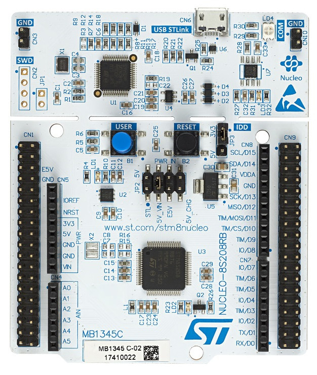
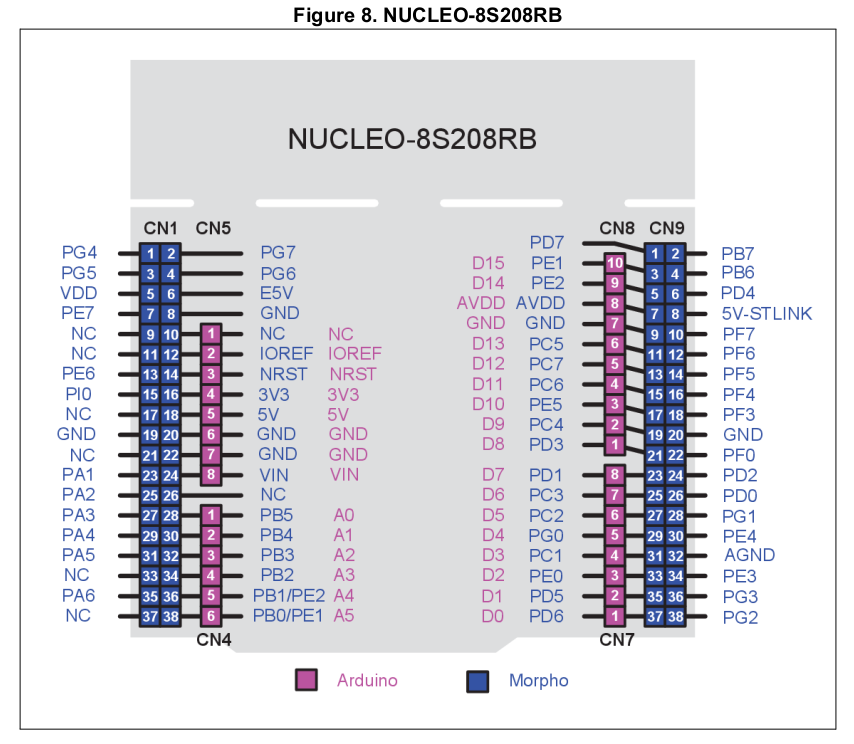
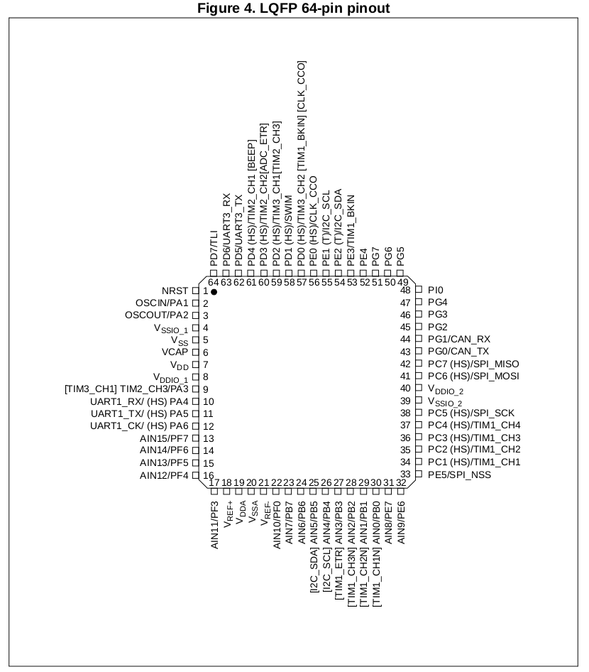
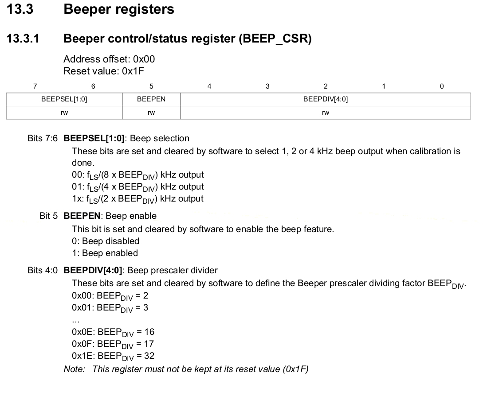

<!-- 
 Tutoriel réalisé par Jacques Deschênes alias PICatout 
 Copyright 2020
 licence: cc sa-by 4.0  
    ref: https://creativecommons.org/licenses/by-sa/4.0/
-->

# Tutoriel stm8 eForth version 3.0 

### Prérequis:

Une carte Carte **NUCLEO-8S208RB** avec stm8 eForth version 3.0 installé.<br/> <br>

Connecteurs sur la carte



Pour une présentation du langage Forth référez-vous à l'article wikipedia [langage Forth](https://fr.wikipedia.org/wiki/Forth_(langage))

## Comparaison de Forth avec le langage C 

Forth se présente comme un langage de bas niveau bien qu'il soit extensible à n'importe quel niveau. Il permet de programmer des microcontrôleurs au plus bas niveau met a aussi été utilisé dans des systèmes complexes. 

Puisque Forth se présente comme un langage de bas niveau il peut sembler déconcertant au départ car l'utilisateur doit lui-même gérer les piles. Contrairement au **C** qui utilise 1 seule pile pour les retours et les arguments **Forth** sépare ses 2 fonctions entre 2 piles. Il y a la pile des arguments et la pile des retours. Certains système Forth utilise même une 3ième pile appellé pile de contrôle. **Stm8 eForth** conserve le modèle traditionnel à 2 piles. 

Ce qui peut-être déconcertant pour le débutant c'est qu'il doit lui-même gérer la pile des arguments. En **C** c'est le compilateur qui s'occupe de ça. Exemple:

    // exemple en C 
    int add(int a, int b ){ 
        return a+b ;
    }

    printf ("%d",add(23,654)); 


    ( en Forth )

    : add ( a b -- a+b )
        + ;

    23 654 add . 

Ces 2 programmes font exactement la même chose. Ils addionnent les entiers *a* et *b* et imprime le résultat. En Forth les paramètres sont toujours passé sur la pile et le résultat s'il y en a 1 (ou plusieurs) sont reçus sur la pile. La notation est dite *Polonaise inversée*. Ça signifie simplement qu'on écris les paramètres des opérateurs ou mots en avant de ces derniers. 

En **C** on doit indiquer le type des arguments et du résultat. En **Forth** comme en **assembleur** le type de données n'est pas spécifié. C'est au programmeur de s'assurer qu'il passe les bonnes données à la fonction.  

### éléments syntaxiques 

* Le langage Forth est des plus simple en terme de syntaxe. Les éléments de la syntaxe appelés  **mots** qui composent une phrase sont séparés par un espace. C'est le seul élément séparateur. Mais il est essentiel de ne pas l'oublier sinon le résultat ne sera pas celui escompté. 

* En Forth les procédures, constantes et variables s'appellent des **mots** et ces mots sont conservés dans un dictionnaire. Ce dictionnaire donne accès à la définition de chaque mot en terme de code à exécuter. En **C** on appelerait ça le corps de la fonction.

* Lorsqu'une constante est invoquée sa valeur est déposée sur la pile. Lorsque le mot *pile* est utilisé seul il s'agit de la pile des arguments. 

* Lorqu'une variable est invoquée son adresse est déposée sur la pile et non sa valeur. 

* Lorsqu'un mot représentant une procédure ou fonction est invoqué son programme est exécuté.

* Lorsque l'interpréteur rencontre un entier il le dépose sur la pile.

* n'importe quel suite de caractères qui a une représentation graphique peut-être utilisé comme nom pour définir un nouveau mot. **Stm8 eForth** utilise les caractères ASCII. Donc tous caractères dont le code ASCII est dans l'intervalle {33..126} peut-être utilisé dans le nom d'un mot. Ça inclus les chiffres. **Stm8 eForth** est sensible à la casse.
```
: ASCII ( imprime la liste des caracteres ASCII) 
CR 32 BEGIN DUP EMIT 1+ DUP 127 = UNTIL DROP ; ok
ASCII
 !"#$%&'()*+,-./0123456789:;<=>?@ABCDEFGHIJKLMNOPQRSTUVWXYZ[\]^_`abcdefghijklmnopqrstuvwxyz{|}~ ok

``` 
N'importe quel de ces caractères à l'exception du premier qui est l'espace (i.e. **32**) peut-être utilisé dans le nom d'une variable, constante ou fonction et il n'est pas obligatoire que le premier caractère du nom soit une lettre. 

### Commentaires 

  Il y a 2 types de commentaires en **Forth** 

  * Les commentaires délimités qui sont indiqués par le mot **(** et se  termine par le premier **')'** rencontré. 

  * Les commentaires qui se termine en fin de ligne et qui sont indiqués par le mot **\\**

  Notez que j'ai utilisé le qualificatif **mot** pour parler de ces 2 éléments de la syntaxe **Forth**. La syntaxe de **Forth** est très simple le seul séparateur des éléments lexical est l'espace. Et puisque **(** et __\\__ sont des mots ils doivent-être séparés du commentaire qui suit par un espace. **)** n'est pas un mot mais un caractère terminateur qui indique la fin du commentaire. Il n'est donc pas nécessaire de mettre un espace entre le dernier caractère du commenataire et la parenthèse de droite.<br>  **( commentaire délimité)**  est un commentaire valide.   

  * **Caractère délimiteur**. Il est important de saisir la différence entre un mot qui est dans le dictionnaire comme le mot **."** et le caractère délimiteur **"**. Les mots sont isolés les uns des autes par un espace à gauche et à droite. Un caractère délimiteur sert à indiquer la fin d'une unité lexicale et n'a pas besoin d'être délimité par un espace de chaque côté. Exemple:
  ```
  : Hello CR ." Hello world!" ; 

  ```
  Le mot **Hello** lorsqu'il est invoqué envoie un caractère ASCII **CR** au terminal et ensuite imprime le message<BR> *Hello world!*.<BR>Le caractère **"** qui termine le message à imprimer est un délimiteur il n'est donc pas nécessaire de mettre un espace entre le **!** et lui. Par contre **."** est un verbe d'action qui est dans le dictionnaire il faut donc qu'il y est un espace à gauche et à droite de lui pour l'isoler afin qu'il soit reconnu par l'analysesur lexical.  

### Gestion de la pile des arguments (paramètres).

 Il peut-être difficile de conserver en mémoire la liste et l'ordre des paramètres qui sont sur la pile lorsqu'on écris une nouvelle définition. On peut se rendre la tâche plus facile en utlisant les commentaire délimités comme aide mémoire. Comme exemple je vais reprendre la définition de ASCII montré plus haut. 
 ```
 : ASCII ( -- ) \ imprime la liste des carcteres ASCII.
 \ Le mot **:** débute une nouvelle définition.
 \ ASCII est le nom de ce nouveau mot tel qu'il sera inscrit dans le dictionnaire. 
 CR \ envoie un caractère de contrôle  'Carriage Return' au terminal. 
 32 ( -- c )  \ l'entier 32 a été empilé. Correspond à l'espace en ASCII
 BEGIN \ débute une boucle 
 DUP    ( -- c c )  \ DUP crée une copie de l'élément au sommet. 
 EMIT   ( c c -- c ) \ la copie du dessuss a étée émise vers le terminal.
 1+     ( c -- c ) \ c a été incrémenté pour passer au caractère suivant.
 DUP    ( c -- c c ) \ cré une copie de c 
 127    ( c c -- c c 127 ) \ empile 127, Correspond au caractère DELETE en ASCII  
=       ( c c 127 -- c flag ) \ compare c et 127 retourne vrai si égaux 
UNTIL   ( c flag -- c )  \ termine la boucle si flag est vrai sinon retourne au début de la boucle.
DROP    ( c -- ) \ jette l'élément qui reste sur la pile. 
;     \ indique la fin de la définition. La compilation s'arrête ici.
ASCII \ invoque le mot que nous venont de définir et le résultat s'affiche.
!"#$%&'()*+,-./0123456789:;<=>?@ABCDEFGHIJKLMNOPQRSTUVWXYZ[\]^_`abcdefghijklmnopqrstuvwxyz{|}~ ok
 ```
* Chaque fois qu'un mot se termine sans erreur le message ** ok** apparaît sinon un message d'erreur est affiché et la pile est vidée de son contenu.

* Le commentaire **( -- )** Après le nom de la définition sert à indiquer la liste des arguments requis par la fonction  à gauche de **--**. La liste de ceux qu'elle retourne est à droite de **--** . Les éléments sont indiqués dans l'ordre 'bas de la pile' à gauche et 'sommet' à droite. Le mot ASCII ne requiert aucun paramètre et ne retourne rien.

* **32 ( -- c )**  Ce commentaire indique qu'il n'y avait rien sur la pile avant d'ajouter le **32**. Le **c** indique que cet entier doit-être considéré comme un caractère ou octet. **Stm8 eForth** utilise des piles avec éléments de 16 bits, donc même si cet élément est interprété comme un caractère ASCII il occupe quand même 16 bits sur la pile. Un emplacement sur la pile est appellé une **cellule**. 

## Notre premier mot 

La carte NUCLEO possède une LED indentifiée **LD2** sur la carte. Cette LED est branchée sur le bit **5** du port **C**. Notre premier programme va s'appeller **BLINK** et va faire clignoter cette LED à une vitesse déterminée par le paramètre que nous allons lui passer. Mais avant de définir **BLINK** nous allons définir une constante et un autre mot qui seront utilisés par **BLINK**. 

```
$500A  CONSTANT LD2 \ adresse du registre que nous devons modifier pour contrôler LD2 
```
Notez que le entiers qui débutent par le caractère **'$'** sont des entiers en hexadécimal. 
```
: LD2-TOGGLE ( -- ) \ Inverse l'état de LD2 
LD2 ( -- a ) \ Empile la constante LD2, i.e. l'adresse $500A
DUP ( a -- a a ) \ Création d'une copie 
C@  ( a a -- a c ) \ Lecture du registre. 'c' est la valeur contenue dans celui-ci.
32 ( a c -- a c 32 ) \ empile l'entier 32 ou 1<<5 
XOR ( a c 32 -- a c ) \ Le bit 5 de 'c' a été inversé 
SWAP ( a c -- c a ) \ inverse la position des 2 éléments au sommet de la pile 
C! ( c a -- ) \ Dépose la valeur 'c' à l'adresse 'a' 
; \ fin  de la définition. 
```
Maintenant si on tape au terminal **LD2-TOGGLE** l'état de **LD2** sur la carte s'inverse. Si elle est éteinte elle s'allume et si elle allumée elle s'éteint. J'ai oublié de mentionner que le bit **5** du port **C** est déjà configuré en mode sortie par le système au démarrage. Si ce n'était pas le cas il aurait fallut le configurer. 

Maintenant on peut définir notre mot **BLINK**. 
```
: BLINK ( n -- ) \ clignote LD2. 'n' détermine le délais en millisecondes.
BEGIN \ On débute une boucle.
LD2-TOGGLE  \ inverse l'état de LD2 
DUP ( n -- n n ) \ Création d'une copie de 'n' 
PAUSE ( n n -- n ) \ l'exécution est suspendu pour 'n' millisecondes 
?KEY ( n -- c t|f ) \ Vérifie s'il y a une touche d'enfoncée 
UNTIL \ s'il n'y en a pas ?KEY retourne seulement 'f' (faux) et le programme boucle 
\ s'il y a une touche ?KEY empile le caractère 'c' et 't' (vrai) alors UNTIL sort de la boucle.
2DROP ( n c -- ) On jette les 2 éléments au sommet de la pile. 
; \ Cette définition est complétée.
167 BLINK \ clignote LD2 3 fois par seconde.
```
Donc pour réaliser ce petit programme on a ajouter 3 mots au dictionnaire du système: 
* la constante **LD2** 
* le mot **LD2-TOGGLE** Pour inverser l'état de la LED LD2 sur la carte.
* **BLINK** le programme lui-même. 

Pour voir tous les mots qui sont dans le dictionnaire ont invoque le mot **WORDS** 

WORDS<br>
 BLINK LD2-TOGGLE LD2 LN2 LOG2 12RT2 SQRT10 E SQRT3 SQRT2 PI IFMOVE UPDAT-PTR FMOVE FADDR RAM2EE RFREE BUF2ROW ROW2BUF EEC, EE, SET-IVEC CHKIVEC RST-IVEC PRISTINE SET-OPT WR-ROW ROW-ERASE EE! EEC! WR-BYTE INC-FPTR LOCK UNLOCK UNLKFL UNLKEE FC@ F@ UPDAT-VP UPDAT-CP UPDAT-RUN UPDAT-LAST EEP-VP EEP-CP EEP-RUN EEP-LAST EEPROM FP! COLD 'BOOT hi WORDS .ID >NAME .S DUMP dm+ _TYPE DOCONST CONSTANT VARIABLE CREATE IMMEDIATE I: : INIT-OFS CALL, ] I; ; OVERT $COMPILE $,n ?UNIQUE ." $" ABORT" AFT REPEAT WHILE AHEAD ELSE THEN IF AGAIN UNTIL BEGIN I NEXT FOR $," LITERAL COMPILE [COMPILE] C, , ALLOT ' QUIT PRESET EVAL ?STACK .OK [ $INTERPRET ABORT" ABORT QUERY ACCEPT KTAP TAP ^H NAME? FIND SAME? NAME> TOKEN WORD \ ( .( PARSE parse ? . U. U.R .R ."| $"| DO$ CR TYPE SPACES SPACE NUF? KEY NUMBER? DIGIT? DECIMAL HEX STR #> SIGN #S # HOLD <# EXTRACT DIGIT PACK0 ERASE FILL CMOVE @EXECUTE TIB PAD HERE COUNT 2@ 2! +! PICK DEPTH >CHAR -1 1 0 BL 2/ RSHIFT LSHIFT 1- 1+ 2* 2- 2+ */ */MOD M* * UM* / MOD /MOD M/MOD UM/MOD WITHIN MIN MAX < U< = ABS - S>D DNEGATE NEGATE NOT + 2DUP 2DROP ROT ?DUP OFFSET RAMLAST LAST CP VP CONTEXT HLD 'EVAL TFLASH TBUF #TIB >IN TMP BASE DOVAR UM+ XOR OR AND 0< OVER SWAP DUP DROP SP! SP@ >R R@ R> RP! RP@ C@ C! @ ! EXIT EXECUTE BRANCH ?BRANCH NEXT DOLIT EMIT ?KEY TO-RAM TO-FLASH REBOOT TIMEOUT? TIMER PAUSE MSEC FREEVAR FORGET AUTORUN SET-ISP DI EI BYE ok


Notez que les mots qu'on a ajoutés apparaîssent au début de la liste dans l'ordre inverse de celui ou on les a définis.

Puisque **LD2-TOGGLE** n'est invoqué qu'une fois à l'intérieur de la définition de **BLINK** on aurait pu insérer sa définition au début de la boucle juste après le **BEGIN** . Mais c'est beaucoup plus lisible comme ça . En Forth il vaut mieux éviter les définitions trop complexes si on veut s'y retrouver. On tend donc à créer de petits mots. De plus de cette façon **LD2** et **LD2-TOGGLE** peuvent-être réutilisés dans d'autres définitions que **BLINK**. 

**Récapitulation** 

* **:** &nbsp;   &lt;chaîne&gt; Sert à passer en mode compilation pour créer une nouvelle défintion qui sera ajoutée au dictionnaire. **&lt;chaîne&gt;** est le nom de ce nouvau mot. 

* **;** &nbsp; Sert a indiquer que la défition est complétée et qu'on doit repasser en mode interprétation.  

* **DUP**  &nbsp; ( i -- i i ) Sert à dupliquer l'élément au sommet de la pile.

* **C@**  &nbsp; ( a -- c ) Empile l'octet qui se trouve à l'adresse *a*. 

* **@**  &nbsp; ( a -- i ) Empile l'entier qui se trouve à l'adresse *a*.

* **C!** &nbsp; ( c a -- ) Dépose l'octet *c* à l'adresse *a*. 

* **!** &nbsp; ( i a -- ) Dépose l'entier *i* à l'adresse *a*. 

* **SWAP**  &nbsp; ( n1 n2 - n2 n1 )  Inverse la position des 2 éléments au sommet de la pile. 

* **XOR**   &nbsp; ( n1 n2 -- n3 ) *n3* est le résultat de  l'opération *ou exclusif* bit à bit entre *n1* et *n2*.

* **DROP**  &nbsp; ( i -- ) Jette l'Élément qui est au sommet de la pile.

* **2DROP**  &nbsp; ( i1 i2 -- ) Jette les 2 éléments qi sont au sommet de la pile.

* **PAUSE**  &nbsp; ( u -- ) Suspend l'exécution pour *u* millisecondes. Sert à créer un délais. 

* **?KEY**  &nbsp; ( -- c t|f ) Vérifie si un caractère venant du terminal est disponible. Si c'est le cas empile ce caractère ainsi que **-1** qui en Forth représente la valeur Booléenne **vrai**. S'il n'y a pas de caractère disponible empile **0** qui en Forth représente la valeur Booléenne **faux**. En fait toute valeur non nul sera traitée comme *vrai* mais les fonctions qui retourne un *flag* retourne *-1* par convention pour dire *vrai*. 

* **KEY**  &nbsp; ( -- c ) Suspend l'exécution jusqu'à réception d'un caractère du terminal. Le caractère reçu est empilé. 

* **EMIT**  &nbsp;  ( c -- ) Émet vers le terminal le caractère au sommet de la pile. 

* **CR**  &nbsp; ( -- ) Envoie le caractère de contrôle *Carriage Return* au terminal. 

* **SPACE**  &nbsp; ( -- ) Envoie le caractère *espace* au terminal. 

* **BEGIN**  &nbsp;  ( -- ) Indique le début d'une boucle. 

* **UNTIL**  &nbsp; ( flag -- ) Vérifie la valeur booléenne *flag* qui est au sommet de la pile. Si cette valeur est fausse retourne au début de la boucle. Sinon termine la boucle. 
Notez que les *flag* sont retirés de la pile lors de leur vérification.

## Produire un son. 

Le STM8S208RB possède un périphérique appellé **BEEP** qui permet de générer une tonalité de façon très simple. Cependant par défaut ce périphéque n'est relié à aucune sortie. Le MCU possède 7 registres d'options. Le registre **2** appellé **AFR** *Alternate Function Register* permettant de modifier le branchement de certains périphériques aux broches. Ainsi la broche **61** est branchée par défaut à **PD4** ( bit 4 du port D ) et **TIM2_CH1**. Les GPIO ne sont pas *remappable* mais **TIM2_CH1** peut-être remplacé par **BEEP**. 



La fonction alternative de cette broche est **BEEP** qui peut-être activée en mettant à **1** le bit **7** du registre **OPT2**. Les registres d'options sont lus au démarrage du MCU donc lorsqu'une option est modifiée il faut redémarrer le MCU. 

```
1 7 LSHIFT 2 SET-OPT REBOOT \ active le BEEP et redémarre le MCU.
```
Maintenant il ne reste qu'à brancher un haut-parleur haute impédance, 130 ohm ou plus, sur le connecteur **CN9-6** de la carte et à programmer le périphérique. 


```
$50F3 CONSTANT BEEP \ registre de contrôle du beeper. 

: BEEP-ON ( n -- ) \ activation du beeper 'n' { 0..30 }
$20 OR BEEP C! ; \  '$20 OR' est pour mettre à **1** le bit **5** de *n* qui active le beeper. 

: BEEP-OFF ( -- ) \ désactivation du beeper. 
$1F BEEP C! ; \ La valeur 31 désactive le beeper.

```
Le Beeper est alimenté par l'oscillateur interne **LSI** de 128 Khz. Avec cette configuration 
cette fréquence est divisée par 8 ce qui donne 16Khz. Le paramètre *n* divise encore cette fréquence. Pour n=0 le diviseur est **2** et pour n=30 le diviseur est **32.** On obient donc 31 fréquences entre 500 hertz et 8 khertz. 

```
\ Alarme double tonalité.
: ALARM
BEGIN 
14 BEEP-ON \ 1Khz ( diviseur = 16 )
150 PAUSE 
10 BEEP-ON  \ 1.33Khz ( diviseur = 12 )
150 PAUSE \ délais de 150 millisecondes
?KEY
UNTIL \ Arrête lorsqu'une touche du terminal est enfoncée.
DROP \ On jette le caractère laissé par ?KEY sur la pile.
BEEP-OFF ; 

```

Générons les 31 fréquences
```
: ALL-FREQ ( -- ) \ Toutes les fréquences en partant de la plus basse. 
30 FOR I BEEP-ON 150 PAUSE NEXT BEEP-OFF ;
```
**Nouveaux mots** 

* **OR** &nbsp; ( n1 n2 -- n3 ) Applique la fonction Booléenne OU bit à bit entre *n1* et *n2*. Le résultat *n3* remplace les 2 paramètres. 

* **FOR** &nbsp; ( n+ -- ) Débute une boucle avec compteur. *n+* est la valeur initiale du compteur. Le compteur est décrémenté à la fin de chaque boucle. La boucle est exécutée **n+1** fois, la boucle s'arrête lorsque le compteur devient négatif. Exemple:
```
: TEST FOR I . NEXT ;
4 TEST 4 3 2 1 0 ok
```
* **I** &nbsp; ( -- i ) Dépose sur la pile le compteur de la boucle FOR. 

* **NEXT** &nbsp; ( R: I -- I |&epsi; ) Décrémente **I** et s'il devient négatif enlève  **I** de la pile des retours et sort de la boucle. Tant que **I&ge;0** retourne au début de la boucle **FOR**.<br>**Note:** le caractère &epsi; est utilisé pour représenté l'absence de tout élément.

* **.** &nbsp; ( .. i ) Imprime au terminal l'entier qui se trouve au sommet de la pile.
Cette valeur est retirée de la pile. Ce mot dans le langage Forth est appellé *dot*. 

* **LSFHIFT** &nbsp; ( n1 n2 -- n3 ) Décale vers la gauche *n1* de *n2* bits. *n3* est le résultat. Les bits à droite sont remplacé par **0**.  C'est l'équivalent de **n1&lt;&lt;n2** en langage **C**.

* **RSHIFT** &nbsp; ( n1 n2 -- n3 ) Décale vers la droite *n1* de *n2* bits. Les bits à gauche sont remplacé par **0**. *n3* est le résultat. C'est l'équivalent de **n1&gt;&gt;n2** en langage **C**. 

## Autre méthode plus flexible pour produire une tonalité.

Supposons que le beeper ne suffise pas à vos besoins. Vous voulez pouvoir générer n'importe quelle fréquence audio. La méthode la plus simple pour faire ça est d'utiliser un périphérique *output compare* configuré en mode PWM. Puisque le haut-parleur est déjà branché sur **CN9-6** on va le laisser là et désactiver l'option BEEPER pour retrouver sur cette broche TIM2_CH1 qu'on va utiliser pour générer nos fréquences audio.
```
0 2 SET-OPT REBOOT \ annule l'option BEEP
```
On va définir une série de constantes pour les adresses des registres qui contrôle TIM2. 
```
$5300 DUP CONSTANT T2-CR1 \ registre de contrôle
1+ DUP CONSTANT T2-IER  \ registre d'activation des interruptions
1+ DUP CONSTANT T2-SR1 \ registre de status 1
1+ DUP CONSTANT T2-SR2 \ registre de status 2
1+ DUP CONSTANT T2-EGR \ générateur d'événement
1+ DUP CONSTANT T2-CCMR1 \ mode capture/compare canal 1
1+ DUP CONSTANT T2-CCMR2 \ mode capture/compare canal 2
1+ DUP CONSTANT T2-CCMR3 \ mode capture/compare canal 3
1+ DUP CONSTANT T2-CCER1 \ activation du canal registre 1
1+ DUP CONSTANT T2-CCER2 \ activation du canal registre 2
1+ DUP CONSTANT T2-CNTRH \ partie haute du compteur
1+ DUP CONSTANT T2-CNTRL \ partie basse du compteur
1+ DUP CONSTANT T2-PSCR \ prédiviseur signal clock
1+ DUP CONSTANT T2-ARRH \ partie haute registre de période
1+ DUP CONSTANT T2-ARRL \ partie basse registre de période
1+ DUP CONSTANT T2-CCR1H \ partie haute registre de comparaison canal 1
1+ DUP CONSTANT T2-CCR1L \ partie basse registre de comparaison canal 1
1+ DUP CONSTANT T2-CCR2H \ partie haute registre de comparaison canal 2
1+ DUP CONSTANT T2-CCR2L \ partie basse registre de comparaison canal 2
1+ DUP CONSTANT T2-CCR3H \ partie haute registre de comparaison canal 3
1+ DUP CONSTANT T2-CCR3L \ partie basse registre de comparaison canal 3
```
Puisque tous les registres se suivent on laisse une copie sur la pile et on l'incrémente pour définir la constante suivante. Ça permet de faire un copier/coller dans la fenêtre du terminal ce qui est plus rapide.

Maintenant on va définir 2 mots l'un pour calculer la valeur à mettre dans T2-ARR à partir de la fréquence désirée. Le deuxième pour calculer la valeur à mettre dant T2-CCR1 pour obtenir un rapport cyclique de 50%. Pour la fréquence on va assumer que le registre T2-PSCR est initialisé à la valeur **3**. Ce qui signifie que Fcntr=Fhsi/2^3 donc 16Mhz/8=2Mhz. Cette fréquence est celle qui va alimenter le compteur T2-CNTR.

```
: PWM-PER ( fr -- u ) \ fr est la fréquence désiré et u la valeur pour ARR.
 31250 64 ( fr -- fr 31250 64 ) \ Astuce expliquée plus bas.
 ROT ( -- 31250 64 fr )
 DUP ( --  31250 64 fr fr ) 
 2/ ( --  31250 64 fr fr/2 )
 >R ( --  31250 64 fr ) R: fr/2 
 */MOD ( -- r q ) \ 31250*8/fr -> reste et quotient
 SWAP ( -- q r ) \ ramène le reste au dessus
 R>   ( -- q r fr/2 ) \ pour calcul de l'arrondie 
 /    ( -- q 0|1 ) \ 
 + \ arrondie à l'entier le plus proche
 ; 

```
Comme stm8_eForth est un système à entiers de 16 bits le plus gros entier positif qu'on peut utiliser est 32767  hors la fréquence du *clock* qui alimente le compteur **T2-CNTR** est à 2Mhz. Pour contourner ce problème On pré-divise 2Mhz/64 ce qui donne 31250 qui est dans le domaine des entiers signés 16 bits {-32768..32767}. L'astuce ici est de le multiplier par 64 en gardant le produit sur 32 bits avant de faire la division par **fr**. Le mot __*/MOD__ est exactement conçu pour régler ce genre de problème. 31250 est d'abord multiplié par 64 et le produit est conservé sur 32 bits ensuite la division de l'entier 32 bits par l'entier 16 bits *fr* est effectuée. Le reste et le quotient sont empilés. 

On a conservé la moitié du diviseur *fr* sur la pile des retours pour pouvoir s'en servir pour calculer l'arrondie à l'entier le plus proche. La division du reste par cette valeur ne peut que donner **0** ou **1** qu'on ajoute au quotient. La valeur *u* qui est maintenant au sommet de la pile est celle qui doit-être déposer dans le registe **T2-ARR**. Il s'agit de 2 registres en fait **T2-ARRH** et **T2-ARRL**. Il est précisé dans le manuel de référence que **ARRH** doit-être écris avant **ARRL.** Donc on ne peut pas utiliser **u T2-ARRH !** pour écrire la valeur 16 bits. On va définir un mot pour faire ça.
```
: R16! ( i a -- ) \ sauvegarde l'entier i dans le registre 16 bits a.
\ a est l'adresse de la partie haute du registre i.e. bits 15..8 
 OVER ( i a -- i a i )
 8 RSHIFT (i a i/256 ) \ bits 15..8 
 OVER  ( i a i/256 a ) 
 C! ( i a i/256 a -- i a ) \ sauvegarde bits 15..8 
 1+ ( i a -- i a+1 ) \ adresse registre bits 7..0 
 C! ( i a+1 -- ) \ sauvegarde bits 7..9
 ;
 ```  

Le rapport cyclique de la tonalité sera calculé à partir de la valeur contenu dans le registre **T2-ARR** et du pourcentage désiré. CCRx=ARR*dc/100+r/50. *dc* est exprimé en %. *r* est le reste de la division. 
```
: PWM-DC ( a dc -- u ) \ calcul valeur pour le registre T2-CCRx à partir de T2-ARR
SWAP ( -- a dc a )
@ ( -- a dc u )
100 ( -- a dc u 100 )
*/MOD ( -- a r q )  \ dc*ARR/100 -> reste et quotient
SWAP ( -- a q r )
50   ( -- a r q 50 )
/    ( -- a r 0|1 ) \ valeur pour arrondie
+ ; ( -- u ) \ Ajusté à l'entier le plus proche
```
Donc maintenant ne reste sur la pile que la valeur à déposer dans le registre **T2-CCR1**. 

On va maintenant créer un mot pour initialiser TIM2_CH1 pour qu'il fonctionne en mode PWM.
```
: TONE-INIT ( -- ) \ Initialise TIM2_CH1 en PWM ave PSCR=3 Ft2=2Mhz 
3 T2-PSCR C! \ dépose la valeur 3 dans T2-PSCR 
1 T2-CCER1 C! \ active le canal 1
$D 3 LSHIFT T2-CCMR1  C! \ configure le canal 1 en mode PWM
; \ terminé
```
Il ne nous reste plus qu'à définir le mot qui va générer la tonalité 
```
: TONE ( ms fr -- ) \ génère une tonalité de fréquence *fr* pour une durée de *ms*.
TONE-INIT \ initialise le périphérique 
PWM-PER T2-ARRH R16! \ initialise la période 
T2-ARRH 50 PWM-DC T2-CCR1H R16! \ initialise le rapport cycle à 50% 
1 T2-EGR C! 1 T2-CR1 C! PAUSE 0 T2-CR1 C! ;
```
Pour générer un tonalité on invoque **TONE** de la façon suivante:
```
500 1000 TONE \ durée 500 msec, fréquence 1000 hertz
```
Le programme suivant joue la gamme tempérée de Do4 
```
: GAMME ( -- ) 
250 ( -- ms ) \ durée de la note
523 ( -- ms fr ) \ première note
11 FOR \ répète cette boucle 12 fois
2DUP ( -- ms fr ms fr ) \ on garde une copie pour la prochaine boucle
TONE ( -- ms fr ) \ on joue la note
12RT2 */ ( ms fr -- ms fr+ ) \ calcul la fréquence de la note suivante
NEXT \ on boucle
2DROP ; \ on jette les 2 arguments restés sur la pile. 
```
Nous allons améliorer ce programme pour le rendre plus flexible et rendre le calcul de la note suivante plus précis en arrondissant à l'entier le plus proche. L'arrondie à l'entier le plus proche est utilisé si souvent qu'on va le définir comme une opération séparée.
```
: ROUND ( r q d -- qr ) 
\ r -> reste de la division. q -> quotient. d -> diviseur. qr -> quotient arrondi 
2/ ( -- r q d2 ) \ moitié du diviseur 
 ROT ( -- q d2 r ) \ ramène r au dessus 
 SWAP ( -- q r d2 ) \ inverse r et d2  
 / \ ( -- q 0|1 ) \ r/d2
 + ; \ quotient arrondi 
```

```
: GAMME ( ms fr -- )
11 FOR ( -- ms fr ) \ R: a I=11  
2DUP TONE ( ms fr ms fr -- ms fr )
12RT2 ( -- ms fr 26797 25293 ) 
DUP >R ( -- ms fr 26797 25293 ) R: a I 25293 
*/MOD ( -- ms r q ) \ fr*25797/25293 -> r q 
R> ( -- ms r q 25293 ) \ R: a I
ROUND \ q arrondi = q+r/(25293/2)
NEXT 2DROP ;
125 440 GAMME \ joue la gamme La3, 125 msec par note.
```

## Contrôle d'un servo-moteur

Les petits servo-moteurs qu'on retrouve sur le marché actuellement sont de type digital plutôt qu'analogique. C'est à dire que le contrôle de la position ne se fait pas par un voltage analogique comme les servo-moteurs traditionnels mais plutôt par une impulsion de largeur variable. Il n'y a 3 connections à effectuer 2 pour l'alimentation et 1 pour l'impulsion de contrôle.

La méthode la plus simple de contrôler ce type de servo-moteur est d'utiliser un périphérique PWM et puisque nous avons déjà définie toutes les constantes pour le **TIMER 2** nous allons utiliser TIM2_CH2 pour contrôler un servo-moteur. Je vais utiliser un Hitec HS-645MG puisque j'en ai un en inventaire. Le cavalier **JP3** doit-être déplacé sur la position 5 volt puisque c'est le voltage d'opération de ce servo-moteur. Ce servo-moteur est contrôlé par une impulsion qui se répète à toutes les 20msec et dont la durée varie entre 900µS et 2100µS. La butée anti-horaire est à 900µS et celle dans le sens horaire à 2100µS. La position midi est à 1500µS.

Il s'agit donc de configurer TIM2_CH2 pour produire une impulsion à toute les 20msec et de faire varier la rapport cyclique pour que l'impulsion varie entre 900µS à 2100µS. La sortie **TIM2_CH2** est disponible sur **CN8-1** ou **CN9-21**. On doit donc connecter le fil de contrôle du servo-moteur sur l'une ou l'autre de ces broches. On va choisir un diviseur de 16 pour le pré-scaler de sorte que le compteur sera cadencé à 1Mhz ce qui va nous donner une résolution 1µSec sur la largeur d'impulsion, 8 fois le *deadband* de ce moteur donc très suffisant. De cette façon la largeur d'impulsion sera identique au compte dans **CCR2**. 

```
: SERVO-INIT ( -- ) \ initialisation canal pour contrôle servo-moteur
4 T2-PSCR C! \ Fcnt=16Mhz/16
$D 3 LSHIFT T2-CCMR2 C! \ canal 2 en mode PWM 
1 4 LSHIFT T2-CCER1 C! \ canal 2 actif 
20000 T2-ARRH R16! \ période 20 msec 
1500 T2-CCR2H R16! \ position neutre 
5 T2-EGR C! \ met à jour les registres 
1 T2-CR1 C! \ active le compteur 
; 
\ contrôle de la position
: SERVO-POS ( u -- ) \ 'u' largeur d'impulsion exprimée en µSec 
T2-CCR2H R16! \ largeur d'impulsion 
5 T2-EGR C! \ mise à jour *update event*
;
\ utilisation 
900 SERVO-POS \ à la butée sens anti-horaire
2100 SERVO-POS \ à la butée sens horaire
1500 SERVO-POS \ au centre 
```
* Notez qu'il se peut que le servo-moteur tire trop de courant lorsque le moteur tourne pour que l'alimentation de la carte soit suffisante.

* Le progamme TONE ne peut-être utilisé en même temps quel le programme qui contrôle le servo-moteur puisqu'ils utilisent le même registre de période **T2-ARR**. Pour les utiliser en même temps il faudrait choisir 2 minuteries différentes.

* Le TIMER 2 possède 3 canaux. Les canaux d'une minuterie partage le même compteur de période donc seul le rapport cyclique peut-être différent entre les canaux. Ça convient bien par exemple pour contrôler une LED RGB ou encore 3 SERVO-MOTEURS. 


